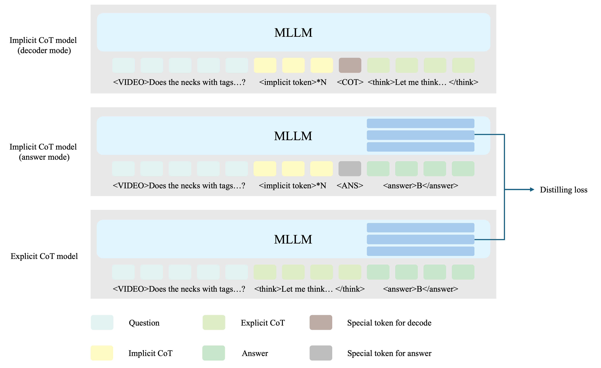

# Distilling Video Reasoning to Implicit CoT tokens

## Background
Chain-of-Thought (CoT) reasoning has garnered significant attention in the field of Multimodal Large Language Models (MLLMs), substantially enhancing their capabilities in complex reasoning tasks. However, explicit CoT methods face two primary challenges: (1) the generation of lengthy and verbose thought chains increases inference latency, reducing the model's responsiveness; (2) the reasoning process is constrained to the token-level text space, which hinders the model's ability to learn higher-level, more abstract patterns of thought.

## Methods
<div>
<p align="center">
  
</p>
</div>

Inspired by research on latent CoT (e.g., [Coconut](https://arxiv.org/abs/2412.06769)), we introduce the paradigm of Implicit CoT to the domain of video reasoning, replacing explicit textual chains with implicit tokens. Our method aims not only to improve inference efficiency but also to enable the model to capture abstract reasoning processes that transcend textual representation. We fine-tune the Qwen-2.5-VL model using a unique training mechanism where a distillation loss from an explicit CoT teacher guides the implicit reasoning process to emulate its patterns. A key feature of our approach is that these implicit states (represented by implicit tokens) can be decoded into human-readable text, enhancing model interpretability.

Specifically, our training process involves three distinct forward passes in each step:
- **Implicit CoT Model (Decoder Mode)**: The objective of this pass is to teach the model how to "translate" its implicit thought process into explicit text. The model is prompted with the video and the corresponding question, followed by ```N``` implicit tokens (represented as ```<pause>``` in our implementation) and a special token ```<COT>``` to signal decoding. To prevent information leakage, where the model might generate the CoT by directly observing the video and question instead of interpreting the implicit tokens, we modify the attention mask. This ensures that during decoding, the model can only attend to the implicit ```<pause>``` tokens and is blocked from accessing the preceding video and question inputs.
- **Implicit CoT Model (Answer Mode)**: This pass trains the model to perform reasoning and derive the final answer directly using its implicit thought process. The model receives the video, the question, and the ```N``` ```<pause>``` tokens, followed by a special answer token, ```<ANS>```. Its task is to synthesize all available information, particularly the internal reasoning embodied by the ```<pause>``` tokens, to generate the final answer after ```<ANS>```. This process emulates the behavior of "silent thinking" before providing an output.
- **Explicit CoT Model (Teacher Model)**: This pass serves as the source of supervision. We employ a standard explicit CoT process where the model, given the video and question, first generates a complete, human-readable thinking process and then outputs the final answer. 

### Training loss
Our model is trained end-to-end with a composite objective function. The total training loss, $\mathcal{L}_{\text{total}}$, consists of two main components: a supervised cross-entropy loss for task-specific generation, and a hidden state distillation loss to align the implicit model's reasoning process with the explicit teacher model.

#### 1. Supervised Cross-Entropy Loss

This loss ensures the model generates the correct CoT explanations and final answers across the three forward passes.

- **Decoder Mode Loss** ($L_{\text{decode}}$): Trains the model to reconstruct the explicit CoT text ($Y_{\text{cot}}$) from the implicit tokens.
    $$
    L_{\text{decode}} = -\sum_{t=1}^{|Y_{\text{cot}}|} \log P(y_t^{\text{cot}} \mid y_{<t}^{\text{cot}}, \text{pause}; \theta)
    $$

- **Answer Mode Loss** ($\mathcal{L}_{\text{answer}}$): Supervises the model to predict the final answer ($Y_{\text{ans}}$) after its implicit reasoning process.
    $$
    \mathcal{L}_{\text{answer}} = -\sum_{t=1}^{|Y_{\text{ans}}|} \log P(y_t^{\text{ans}} \mid y_{<t}^{\text{ans}}, V, Q, \text{pause}; \theta)
    $$

- **Teacher Model Loss** ($\mathcal{L}_{\text{teacher}}$): The standard loss for the explicit CoT model, which generates both the CoT and the answer.
    $$
    \mathcal{L}_{\text{teacher}} = -\sum_{t=1}^{|Y_{\text{cot}}| + |Y_{\text{ans}}|} \log P(y_t \mid y_{<t}, V, Q; \theta)
    $$

The total task-oriented loss, $\mathcal{L}_{\text{task}}$, is the weighted sum of these three components:
$$
\mathcal{L}_{\text{task}} = 0.5 \cdot \mathcal{L}_{\text{decode}} + 0.5 \cdot \mathcal{L}_{\text{answer}} + \mathcal{L}_{\text{teacher}}
$$

#### 2. Hidden State Distillation Loss

To ensure the implicit reasoning process captures meaningful semantics, we align the hidden states of the Implicit CoT Model (Answer Mode) with those of the Explicit CoT Model. This alignment is specifically performed on the hidden states corresponding to the generation of the final answer tokens.

Let $H_{S, \text{ans}}^{(l)}$ and $H_{T, \text{ans}}^{(l)}$ be the hidden state representations for the answer tokens from the $l$-th layer of the student (Implicit Answer Mode) and teacher models, respectively. Since hidden state scales can vary across layers, we normalize the L1 distance for each layer by the standard deviation of the teacher's hidden states for that layer. The normalized L1 loss for the $l$-th layer is:
$$
\ell_{\text{distill}}^{(l)} = \frac{\| H_{S, \text{ans}}^{(l)} - H_{T, \text{ans}}^{(l)} \|_1}{\text{std}(H_{T, \text{ans}}^{(l)})}
$$

The final distillation loss, $\mathcal{L}_{\text{distill}}$, is the mean of these normalized losses across all $L$ layers of the model:
$$
\mathcal{L}_{\text{distill}} = \frac{1}{L} \sum_{l=1}^{L} \ell_{\text{distill}}^{(l)}
$$

#### 3. Overall Training Objective

The final training objective is a weighted combination of the task loss and the distillation loss:
$$
\mathcal{L}_{\text{total}} = \mathcal{L}_{\text{task}} + 10 \cdot \mathcal{L}_{\text{distill}}
$$

## Quick Start
Please first download the checkpoints of [Qwen-2.5-VL](https://huggingface.co/Qwen/Qwen2.5-VL-7B-Instruct) and [Video-R1 dataset](https://huggingface.co/datasets/Video-R1/Video-R1-data).
```
git clone https://github.com/qiulu66/Implicit-Video-Reasoning.git
cd Implicit-Video-Reasoning
mkdir pretrained
cd pretrained
git clone https://huggingface.co/Qwen/Qwen2.5-VL-7B-Instruct
```
```
cd ..
git clone https://huggingface.co/datasets/Video-R1/Video-R1-data
```
Then, run the following command to train the model:
```
bash ./src/video_r1/scripts/run_sft_with_query_distilling.sh
```

## Inference
To perform inference with our implicit reasoning model, it is crucial to format the input prompt to match the **Answer Mode** used during training. This special format triggers the model's internal reasoning process before it generates the final answer.

Specifically, you must append a sequence of implicit tokens (`<pause>`) followed by the special answer token (`<ANS>`) to the end of the assistant's turn in the prompt. The `<pause>` tokens serve as placeholders for the model's latent thought process, and the `<ANS>` token signals the model to provide the final answer.

The number of `<pause>` tokens should match the number used during training (e.g., 8 tokens). Here is a complete example:
```text
<|im_start|>system
You are a helpful assistant<|im_end|>
<|im_start|>user
<|vision_start|><|image_pad|><|vision_end|>Does the necks with name tags lie behind the curtains with a large window? Options:
A. Yes
B. No
Please provide only the single option letter (e.g., A, B, C, D, etc.) within the <answer> </answer> tags.<|im_end|>
<|im_start|>assistant
<pause><pause><pause><pause><pause><pause><pause><pause><ANS>
```
The expected model completion might be:
```text
<answer>A</answer>
```
You can also decode the implicit tokens by replacing `<ANS>` with `<COT>`. Please note that you will need to modify the corresponding attention mask to mask out the video and question to match the training process. The relevant code for this will be coming soon.

## References & Acknowledgements
We sincerely thank the contributions from the open source community, including the reproduction of [Video-R1](https://github.com/tulerfeng/Video-R1) and [Open-R1-Video](https://github.com/Wang-Xiaodong1899/Open-R1-Video).

## Citation
If you find this useful, you can choose to cite us.

```bibtex
@misc{implicit-video-reasoning,
  author = {Qiu, Lu and Ge, Yuying and Li, Yizhuo and Liu, Xihui},
  title = {Implicit-Video-Reasoning},
  year = {2025},
  publisher = {GitHub},
  journal = {GitHub repository},
  howpublished = {\url{https://github.com/qiulu66/Implicit-Video-Reasoning}}
}
```